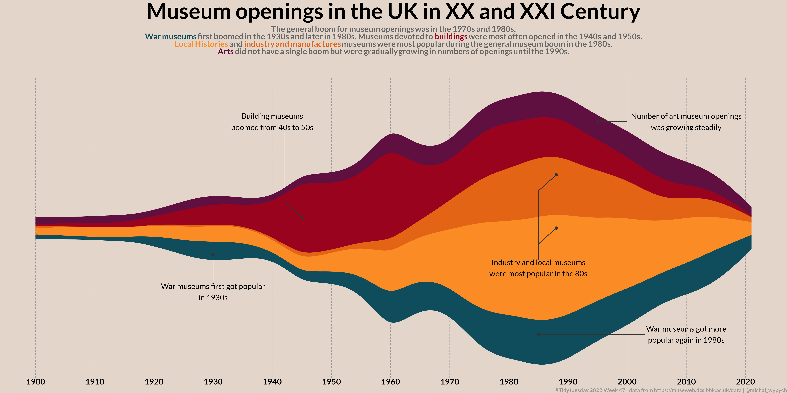
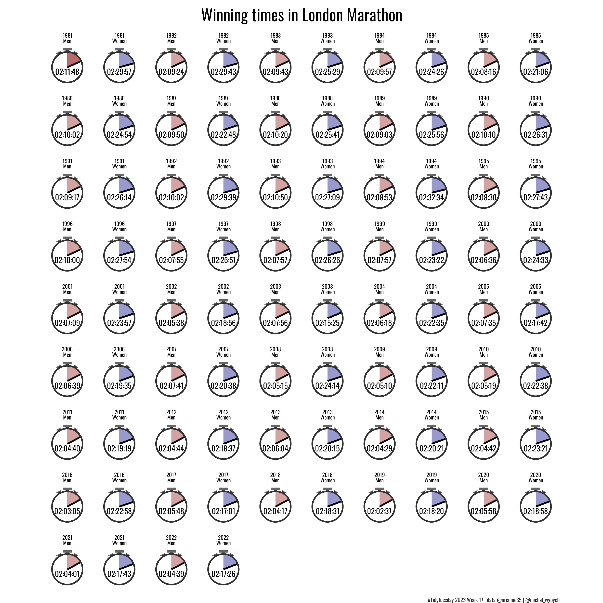
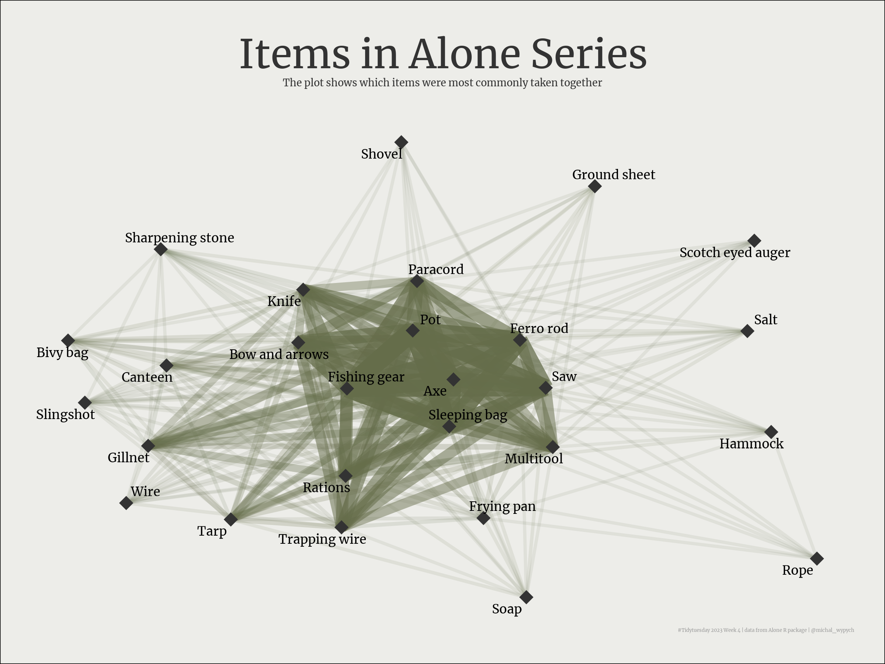
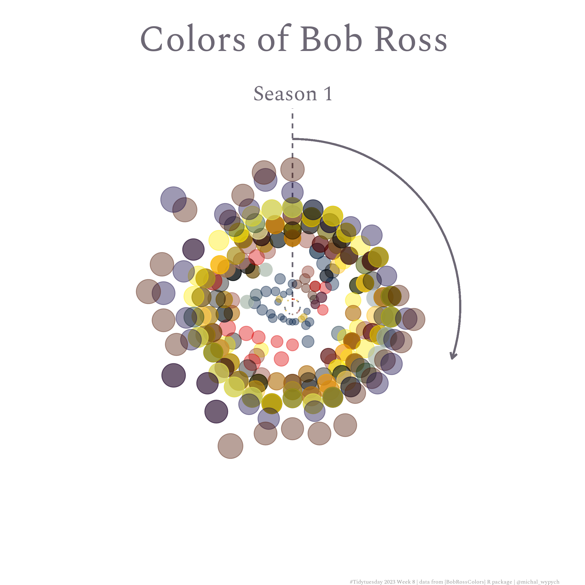
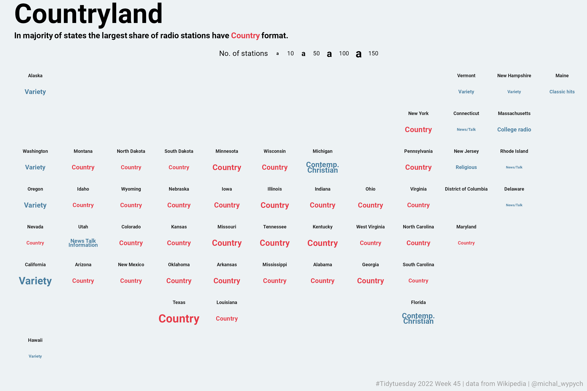
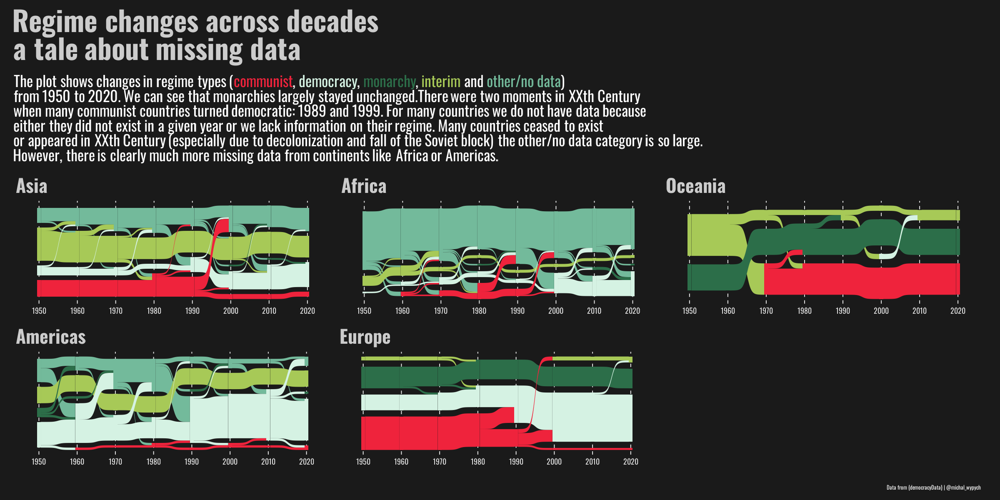
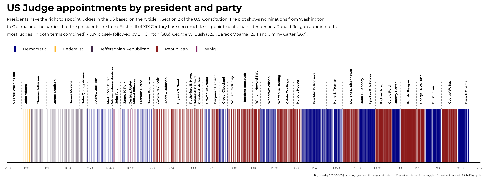
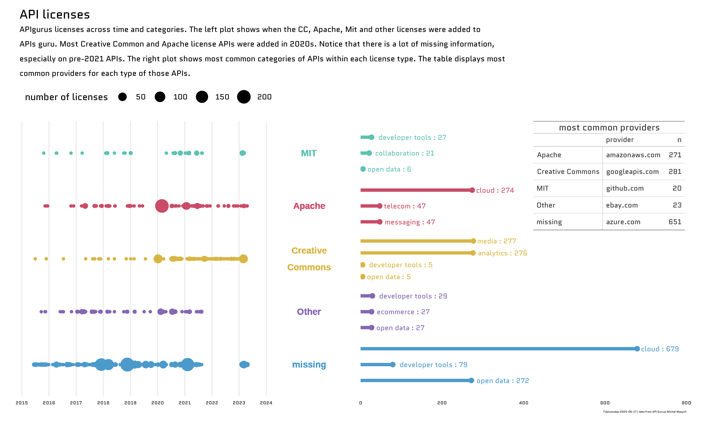

I’m an R / Shiny Dev with a background in academia and psychology. I specialize in research design, statistical analysis, and turning data into actionable insights. Passionate about making data meaningful and impactful

I work with `R`, `Python`, `SQL`

Some of my `Tidytuesday` submissions:
---

    

 
<!--
**Honestiore/Honestiore** is a ✨ _special_ ✨ repository because its `README.md` (this file) appears on your GitHub profile.

Here are some ideas to get you started:

- 🔭 I’m currently working on ...
- 🌱 I’m currently learning ...
- 👯 I’m looking to collaborate on ...
- 🤔 I’m looking for help with ...
- 💬 Ask me about ...
- 📫 How to reach me: ...
- 😄 Pronouns: ...
- ⚡ Fun fact: ...
-->
